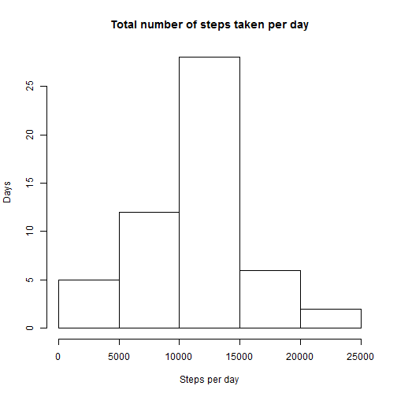
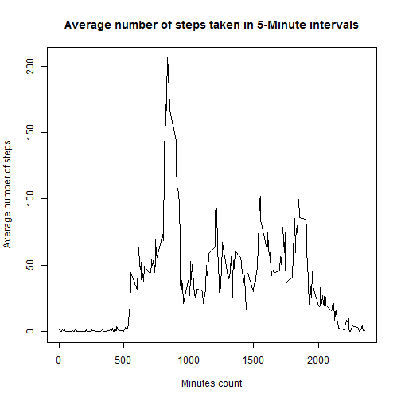
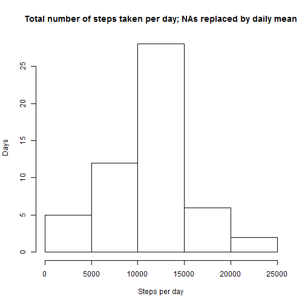
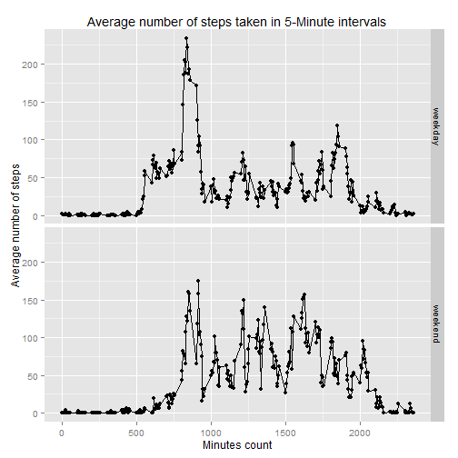

#### Data loading and preprocessing
1. Load the data 
2. Process the data 


```r
setwd("E:/KATKA/COURSERA/5-ReproducableResearch/PROJECTS")
df1 <- read.csv('project1_data_activity.csv', header = TRUE)
```

#### What is mean total number of steps taken per day? 
1. Calculate the total number of steps taken per day (ignore NA) 
2. Make a histogram of the total number of steps taken each day  
3. Calculate and report the mean and median of the total number of steps taken per day  


```r
dfAgr <- aggregate(steps ~ date, data = df1, sum)

hist(dfAgr$steps, breaks = 5,
     xlab = "Steps per day", ylab = "Days",
     main = "Total number of steps taken per day")
```

 

```r
mymean <- mean(dfAgr$steps, na.rm = TRUE)
mymedian <- median(dfAgr$steps, na.rm = TRUE)
```
The mean of the total number of steps taken per day is 10766.  
The median of the total number of steps taken per day is 10765.

#### What is the average daily activity pattern?
1. Make a time series plot (i.e. type = "l") of the 5-minute interval (x-axis) and the average number of steps taken, averaged across all days (y-axis)
2. Which 5-minute interval, on average across all the days in the dataset, contains the maximum number of steps?


```r
dfAgr <- aggregate(steps~interval, df1, FUN = mean, na.rm = TRUE)

plot.ts(dfAgr$interval,dfAgr$steps, type = "l", 
        xlab = "Minutes count", ylab = "Average number of steps",
        main = "Average number of steps taken in 5-Minute intervals")
```

 

```r
ind<- which.max(dfAgr$steps)
maxint<- dfAgr$interval[ind]
```
The 5-minute interval containing maximum number of steps starts from 835 minute.

#### Imputing missing values
1. Calculate the total number of missing values NA in the dataset (i.e. the total number of rows with NAs)
2. Devise a strategy for filling in all of the missing values in the dataset. For example, use the mean/median for that day.
3. Create a new dataset that is equal to the original dataset but with the missing data filled in.
4. Make a histogram of the total number of steps taken each day and Calculate and report the mean and median total number of steps taken per day. Do these values differ from the estimates from the first part of the assignment? 


```r
indNA <- is.na(df1$steps)
totalNA <- sum(indNA)

# compute mean daily 
dfAgr <- aggregate(steps ~ date, df1, FUN = mean, na.rm = TRUE)
# assosicate daily mean to the original data
dfMerged <- merge(x = df1, y = dfAgr, by.x = "date", by.y = "date")
# replace missing data with the daily mean
dfMerged$steps.x[is.na(dfMerged$steps.x)] = dfMerged$steps.y

dfAgr <- aggregate(steps.x~date, data = dfMerged, sum)

hist(dfAgr$steps.x, breaks = 5,
     xlab = "Steps per day", ylab = "Days",
     main = "Total number of steps taken per day; NAs replaced by daily mean")
```

 

```r
mymean2 <- mean(dfAgr$steps, na.rm = TRUE)
mymedian2 <- median(dfAgr$steps, na.rm = TRUE)
```
The total number of missing values NA in the dataset is 2304.  
The missing data were filled by daily mean.  
The mean of the total number of steps taken per day is 10766.    
The median of the total number of steps taken per day is 10765.  

#### Are there differences in activity patterns between weekdays and weekends?
1. Create a new factor variable in the dataset with two levels – “weekday” and “weekend”.Use the dataset with the filled-in missing values.  
2. Make a panel plot containing a time series plot (i.e. type = "l") of the 5-minute interval (x-axis) and the average number of steps taken, averaged across all weekday days or weekend days (y-axis). See the README file in the GitHub repository to see an example.


```r
weekday <- weekdays(as.Date(df1$date)); 
# creates new column which assosiate 1 with Saturday/Sunday, 0 otherwise 
df1$day <- ifelse(weekday == 'Saturday'| weekday == 'Sunday', 1, 0)
# create factor
df1$day <- factor(df1$day,labels = c("weekday","weekend"))

dfAgr <- aggregate(steps~interval+day, df1, FUN = mean, na.rm = TRUE)

library("ggplot2")
```

```
## Warning: package 'ggplot2' was built under R version 3.1.2
```

```r
qplot(interval, steps, data = dfAgr, facets = day~.,
      xlab = "Minutes count",ylab = "Average number of steps",
      main = "Average number of steps taken in 5-Minute intervals",
      ylim(0,250) ) + geom_line()
```

 

#### Submitting the Assignment
Fork/clone the GitHub repository created for this assignment. You will submit this assignment by pushing your completed files into your forked repository on GitHub. The assignment submission will consist of the URL to your GitHub repository and the SHA-1 commit ID for your repository state.
